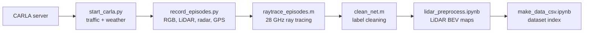

# Multi-Modal Dataset Generation for "Efficient Domain Generalization in Wireless Networks With Scarce Multi-Modal Data"

This repository contains the framework we used to generate the multi-modal wireless dataset in our paper. You can adapt it to your own scenario, including the base station (BS) location, coverage area, traffic, weather and ray-tracing parameters.

A BS placed in the CARLA *Town 10* map has a co-located RGB camera, LiDAR and radar, and the positions of the surrounding vehicles are logged (the GPS modality). MATLAB ray tracing at 28 GHz then labels every frame with a received-signal-strength (RSS) and line-of-sight (LoS) map over a grid of receivers. The final output is an index CSV. Each row links the RGB image, preprocessed LiDAR map, radar detections, vehicle GPS table and RSS/LoS label of one frame.

## Paper

M. Kim, W. Saad, and D. Calin, "Efficient Domain Generalization in Wireless Networks With Scarce Multi-Modal Data," *IEEE Transactions on Wireless Communications*, vol. 25, pp. 23144–23160, 2026. [[IEEE]](https://doi.org/10.1109/TWC.2026.3725258) [[arXiv]](https://arxiv.org/abs/2510.04359)

```bibtex
@article{kim2026efficient,
  title   = {Efficient Domain Generalization in Wireless Networks With Scarce Multi-Modal Data},
  author  = {Kim, Minsu and Saad, Walid and Calin, Doru},
  journal = {IEEE Transactions on Wireless Communications},
  volume  = {25},
  pages   = {23144--23160},
  year    = {2026},
  doi     = {10.1109/TWC.2026.3725258}
}
```

## Pipeline



| Step | Script | Output (inside `base_station/`) |
|---|---|---|
| 1–2. Simulation | CARLA server + `start_carla.py` | background traffic and weather |
| 3. Sensor capture | `record_episodes.py` → `base_station/record_sensor_data.py` | `_out_rgb/`, `_out_lidar/`, `_out_radar/`, `_out_gps/` |
| 4. Ray tracing | `raytrace_episodes.m` → `matlab/network_simulate.m` → `matlab/GetNetworkInfo.m` | `_out_net/` |
| 5. Label cleaning | `clean_net.m` | `_out_cleaned_net/` |
| 6. LiDAR preprocessing | `lidar_preprocess.ipynb` | `preprocessed_out_lidar/` |
| 7. Dataset index | `make_data_csv.ipynb` | `dataset_index_local.csv` |

## Repository structure

```text
.
├── start_carla.py               # spawns autopilot traffic, sets weather, ticks the world
├── record_episodes.py           # records a range of episodes
├── base_station/                # BS configuration; generated data is also written here
│   ├── __init__.py
│   ├── config.py                # BS pose, capture region, output root (Python side)
│   ├── config.m                 # BS pose and output root (MATLAB side)
│   └── record_sensor_data.py    # CARLA sensor capture
├── raytrace_episodes.m          # MATLAB driver: ray-traces all frames of a range of episodes
├── matlab/
│   ├── network_simulate.m       # per-episode loop; computes RSS/LoS and writes _out_net
│   ├── GetNetworkInfo.m         # builds the scene (map + vehicle boxes), Tx/Rx sites, runs raytrace
│   ├── bpy_combine.py           # optional Blender scene merge (not used by default)
│   └── heatmap_generate.m       # optional RSS heatmap plot (edit episode_idx and txPos first)
├── clean_net.m                  # repairs NaN receivers and LoS flags -> _out_cleaned_net
├── lidar_preprocess.ipynb       # LiDAR .ply -> 256x256 bird's-eye-view histogram (.npy)
├── make_data_csv.ipynb          # joins all modalities per frame -> dataset_index_local.csv
├── utility.py                   # radar debug-drawing helpers (optional)
├── requirements.txt
└── LICENSE
```

## Requirements

| Component | Version |
|---|---|
| OS | Linux; Ubuntu 20.04 or newer (the `open3d` wheel needs glibc 2.31+) |
| CARLA | [0.9.15](https://github.com/carla-simulator/carla/releases/tag/0.9.15) |
| Python | 3.9 |
| MATLAB | R2024b with Communications Toolbox, Phased Array System Toolbox and Lidar Toolbox (`readSurfaceMesh`) |
| GPU | Required by CARLA (see the [CARLA quickstart](https://carla.readthedocs.io/en/0.9.15/start_quickstart/)) |

Blender is **not** required. Vehicles are inserted into the ray-tracing scene as boxes directly in MATLAB.

## Installation

In the commands below, `<repo>` is the path of this repository.

**1. Python environment**

```bash
conda create -n dg-data python=3.9 -y
conda activate dg-data
pip install -r requirements.txt
```

**2. CARLA 0.9.15.** Download and extract the CARLA 0.9.15 package from the [CARLA release page](https://github.com/carla-simulator/carla/releases/tag/0.9.15).

**3. 3D map for ray tracing.** The map is not included in this repository. It is the 2-lane Town 10 model from the [3D model release](https://github.com/news-vt/Multimodal-Realistic-Simulation-Framework-for-Sensing-aided-Communication/releases/tag/3d_model) of the [Multimodal Realistic Simulation Framework](https://github.com/news-vt/Multimodal-Realistic-Simulation-Framework-for-Sensing-aided-Communication). Download it and convert it to `matlab/temp_map.ply`, the file the ray tracer loads:

```bash
cd <repo>
wget https://github.com/news-vt/Multimodal-Realistic-Simulation-Framework-for-Sensing-aided-Communication/releases/download/3d_model/3d_model.zip
unzip 3d_model.zip -d 3d_model        # sudo apt install unzip, if needed
python -c "import numpy as np, trimesh; m = trimesh.load('3d_model/Town10_2lane.glb', force='mesh'); m.apply_transform(trimesh.transformations.rotation_matrix(np.pi/2, [1, 0, 0])); m.export('matlab/temp_map.ply')"
```

The rotation converts the glTF model (Y-up) to the Z-up MATLAB coordinates used by the ray tracer (see [Coordinate systems](#adapting-to-your-own-setting)). The resulting mesh spans roughly x ∈ [−92.5, 116.2] m, y ∈ [−5.2, 126.0] m and z ∈ [−1.0, 177.2] m, with the ground at z ≈ 0.

## Generating the dataset

Run every command **from the repository root**, because all output paths (`./base_station/...`) are relative to the working directory. You need three terminals: the CARLA server, `start_carla.py` and the recorder.

### 1. Start the CARLA server

```bash
cd /path/to/CARLA_0.9.15
./CarlaUE4.sh
```

Keep this terminal open. The dataset uses Town 10 (`Town10HD_Opt`), the default map of CARLA 0.9.15. To check the loaded map:

```bash
python -c "import carla; c=carla.Client('127.0.0.1',2000); c.set_timeout(10); print(c.get_world().get_map().name)"
```

### 2. Spawn traffic and set the weather

```bash
cd <repo>
conda activate dg-data
python start_carla.py --host 127.0.0.1 --port 2000 -n 60 --wKind 0
```

Keep this terminal running for the whole recording session. It spawns the autopilot vehicles, switches the world to synchronous mode with a 0.1 s step, and ticks the world. Press Ctrl+C to stop it and remove the vehicles.

| Flag | Default | Description |
|---|---|---|
| `-n`, `--number-of-vehicles` | 50 | Number of autopilot vehicles |
| `--wKind` | 0 | Weather: `0` sunny, `1` night, `2` fog, `3` rain |
| `-s`, `--seed` | none | Random seed for spawning and the Traffic Manager |
| `--tm-port` | 8000 | Traffic Manager port (the recorder expects 8000) |

Do not use `--no-rendering`: in that mode CARLA cameras return no images.

### 3. Record sensor data

In a third terminal:

```bash
cd <repo>
conda activate dg-data
python record_episodes.py --episodes 11 --previous_episode 0
```

| Flag | Default | Description |
|---|---|---|
| `--episodes E` | required | Upper bound (exclusive) of the episode index |
| `--previous_episode P` | 0 | Last episode already recorded |
| `--host`, `--port` | 127.0.0.1, 2000 | CARLA server |

Episodes `P+1` to `E-1` are recorded, so the example above records `episode_1` to `episode_10`. In each episode:

1. The camera, LiDAR and radar are spawned as static sensors at the BS pose (`bs_location`, `bs_rotation`).
2. The world advances until at least one vehicle enters the capture region (`MAP_X` × `MAP_Y`).
3. From then on, one frame of every modality is saved per tick, until `MAX_STEP` frames are saved or all vehicles leave the region.

GPS files are written in append mode. Delete the old `base_station/_out_*/episode_k/` folders before re-recording an episode.

### 4. Ray tracing (MATLAB)

```bash
cd <repo>
matlab -batch "raytrace_episodes(10, 1)"
```

`raytrace_episodes(numEpisodes, prevEpisode)` processes episodes `prevEpisode` to `numEpisodes`, **inclusive**. To process the episodes recorded by `record_episodes.py --episodes E --previous_episode P`, call `raytrace_episodes(E-1, P+1)`. The BS pose and output root come from `base_station/config.m`; only its `SAVE_ROOT`, `ORIG_bs_location` and `ORIG_bs_rotation` fields are used.

For every GPS file `base_station/_out_gps/episode_k/NNNNNN.csv`, each vehicle is added to `matlab/temp_map.ply` as a box sized by its vehicle type. All receivers are then ray-traced, and the results are written to `base_station/_out_net/episode_k/`. Frames that are already processed are skipped, so an interrupted run can be resumed.

| Setting | Value | Where |
|---|---|---|
| Carrier frequency | 28 GHz | `fc` in `GetNetworkInfo.m`, `fc_ghz` in `network_simulate.m` |
| Transmitter | BS position, 8 × 8 URA with half-wavelength spacing, `TransmitterPower = 25` (W) | `txsite` in `GetNetworkInfo.m` |
| Transmitter orientation | `AntennaAngle` = `[ORIG_bs_rotation(1) + 30, ORIG_bs_rotation(2)]` | `raytrace_episodes.m`, `GetNetworkInfo.m` |
| Receivers | 10 × 8 grid over x ∈ [−10, 60] m, y ∈ [44, 86.32] m, at 1.5 m height; 4-element ULA | `x_min` … `numYgrids` in `GetNetworkInfo.m` |
| Propagation model | Shooting-and-bouncing rays, up to 1 reflection and 1 diffraction, max. path loss 120 dB | `propagationModel` in `GetNetworkInfo.m` |
| `RSS_dBm` | `Pt_dBm` (43.98 dBm = 25 W) minus the path loss, power-summed over the (up to) 5 strongest rays per receiver | `network_simulate.m` |
| `hasLoS` | Whether a direct line-of-sight ray exists | `network_simulate.m` |
| `RSS_LoS_dBm` | Reference LoS power `Pt_dBm − (32.4 + 21 log10(d) + 20 log10(fc_ghz))` (3GPP UMi LoS path loss, `d` = 3-D Tx–Rx distance) | `network_simulate.m` |

### 5. Clean the labels

```bash
cd <repo>
matlab -batch "clean_net"
```

This fills receivers with NaN position or RSS from neighbouring rows, and sets `hasLoS = true` where `RSS_dBm > RSS_LoS_dBm`. The results are written to `base_station/_out_cleaned_net/episode_k/NNNNNN.csv_rss_map_cleaned.csv`.

### 6. Preprocess LiDAR

Open `lidar_preprocess.ipynb` from the repository root (e.g. `jupyter lab`) and run the cells under **Helper functions** and **Convert all LiDAR frames**. The last section is an optional PyTorch `Dataset` example for the final index and needs `torch` and `torchvision`.

Each point cloud in `base_station/_out_lidar/` is rotated, height-filtered and binned into a 256 × 256 bird's-eye-view histogram (x ∈ [0, 150] m, y ∈ [−150, 150] m, at most 10 points per cell, normalized to [0, 1]). The result is saved as `base_station/preprocessed_out_lidar/episode_k/NNNNNN.npy` (float16, shape `(1, 256, 256)`).

### 7. Build the dataset index

Run `make_data_csv.ipynb` from the repository root. It prints `saved → <repo>/base_station/dataset_index_local.csv`. Only frames that exist in all five modalities (GPS, LiDAR, RGB, radar, RSS) are kept.

## Adapting to your own setting

| What | Where |
|---|---|
| BS position and orientation | `bs_location`, `bs_rotation` in `base_station/config.py`, **and** `ORIG_bs_location`, `ORIG_bs_rotation` in `base_station/config.m` (keep them identical). A few BS-specific values are set separately: the radar height and pitch in `record_sensor_data.py`, the LiDAR rotation in `lidar_to_histogram_features` (`lidar_preprocess.ipynb`), `bspos` in the optional `Dataset` cell, and `txPos` in `matlab/heatmap_generate.m`. |
| Capture region | `MAP_X`, `MAP_Y` in `base_station/config.py` (MATLAB coordinates, see below) |
| Frames per episode | `MAX_STEP` in `base_station/config.py` |
| Number of vehicles, weather | `-n`, `--wKind` of `start_carla.py` |
| Sensor settings | `record_sensor_data.py` (camera, LiDAR and radar blueprints) |
| Receiver grid | `x_min`, `x_max`, `y_min`, `y_max`, `numXgrids`, `numYgrids` in `matlab/GetNetworkInfo.m` (MATLAB coordinates) |
| Antennas, propagation model | `matlab/GetNetworkInfo.m` |
| Carrier frequency | `fc` in `matlab/GetNetworkInfo.m` **and** `fc_ghz` in `matlab/network_simulate.m` (keep them equal) |
| Transmit power | `Pt_dBm` in `matlab/network_simulate.m` (used for the RSS labels) and `TransmitterPower` in `matlab/GetNetworkInfo.m` |
| RSS / LoS computation | `matlab/network_simulate.m` |
| LiDAR histogram range | `lidar_to_histogram_features` in `lidar_preprocess.ipynb` |
| Ray-tracing map | `matlab/temp_map.ply`. To use another region, export it from CARLA as described in the upstream guide ["Exporting CARLA Map Mesh for Ray Tracing"](https://github.com/news-vt/Multimodal-Realistic-Simulation-Framework-for-Sensing-aided-Communication#-exporting-carla-map-mesh-for-ray-tracing), then convert it as in Installation step 3. The mesh is used as is, so it must be in MATLAB coordinates (Z-up). |

**Coordinate systems.** "MATLAB coordinates" means X = CARLA x, Y = −(CARLA y), Z = CARLA z (up). `MAP_X`, `MAP_Y`, the GPS `X, Y, Z` columns, the ray-tracing map, the receiver grid and the RSS maps use MATLAB coordinates. `bs_location`, `bs_rotation` and the GPS `Yaw, Pitch, Roll` columns use CARLA coordinates; `raytrace_episodes.m` flips the Y axis of the BS position for MATLAB.

Current BS configuration:

| Field | Value |
|---|---|
| `bs_location` (CARLA) | [26.252628, −86.328842, 5] |
| `bs_rotation` [pitch, yaw] | [0, 90] |
| `MAP_X` | [−15, 65] (coverage area plus a 5 m margin on each side) |
| `MAP_Y` | [44, 86.32] |
| `MAX_STEP` | 5 |
| `FIXED_DELTA` | 0.1 s (simulation step and sensor tick) |

## Output format

```text
base_station/
├── _out_rgb/episode_k/NNNNNN.png                         # RGB image, 960 x 540, FOV 90°
├── _out_lidar/episode_k/NNNNNN.ply                       # LiDAR point cloud
├── _out_radar/episode_k/NNNNNN.npy                       # radar detections, float32 (M, 4)
├── _out_gps/episode_k/NNNNNN.csv                         # vehicles inside the capture region
├── _out_net/episode_k/NNNNNN.csv_rss_map.csv             # raw ray-tracing labels
├── _out_net/episode_k/NNNNNN.csv.mat                     # raw rays (MATLAB comm.Ray objects)
├── _out_cleaned_net/episode_k/NNNNNN.csv_rss_map_cleaned.csv
├── preprocessed_out_lidar/episode_k/NNNNNN.npy           # BEV histogram, float16 (1, 256, 256)
└── dataset_index_local.csv                               # final index
```

`NNNNNN` is the frame ID returned by the recorder's `world.tick()` (zero-padded to 6 digits); all files saved at that tick use the same ID. When loading `dataset_index_local.csv` with pandas, use `dtype={"Frame": str}` to keep the padding.

| Sensor | Settings |
|---|---|
| RGB camera | 960 × 540, FOV 90° |
| LiDAR | 32 channels, vertical FOV +25.5° / −22.5°, range 250 m, 1.5 M points/s |
| Radar | 150° × 30° FOV, range 50 m, 20 000 points/s; each detection is `[velocity, azimuth, altitude, depth]` |

| File | Columns |
|---|---|
| GPS | `Frame, Timestamp, Vehicle_ID, X, Y, Z, Yaw, Pitch, Roll` (`Timestamp` is wall-clock time; `Vehicle_ID` is the CARLA blueprint name) |
| RSS map | `x_m, y_m, z_m, RSS_dBm, hasLoS, RSS_LoS_dBm` (one row per receiver) |
| Index | `Scene, Episode, Frame, GPS, LiDAR, RGB, Radar, RSS` (`Scene` = `base_station`, `Episode` = `episode_k`, `Frame` = frame ID; the modality columns are absolute file paths) |

## Troubleshooting

- **The recorder never finishes an episode.** It waits until a vehicle enters `MAP_X` × `MAP_Y`. Make sure `start_carla.py` is running and has spawned vehicles.
- **`start_carla.py` exits with `time-out ... while waiting for the simulator`.** The server was left in synchronous mode by a previous run. Restart the CARLA server.
- **MATLAB warns `Folder ... not found – skipped`.** The episode range or the working folder is wrong. Start MATLAB from the repository root and check the range mapping in Step 4.
- **MATLAB cannot read `temp_map.ply`.** Create it as described in Installation step 3.

## Acknowledgement

This framework builds on the [Multimodal Realistic Simulation Framework for Sensing-aided Communication](https://github.com/news-vt/Multimodal-Realistic-Simulation-Framework-for-Sensing-aided-Communication) (MIT License, Copyright (c) 2025 NEWS@VT & NIL@KHU). `utility.py` is taken from it, `start_carla.py` and `matlab/bpy_combine.py` are adapted from it, and the 3D map comes from its releases. The simulation uses [CARLA](https://github.com/carla-simulator/carla).

## License

This project is released under the [MIT License](LICENSE). Code adapted from the Multimodal Realistic Simulation Framework and from CARLA keeps its original MIT copyright notices, listed in [LICENSE](LICENSE).
